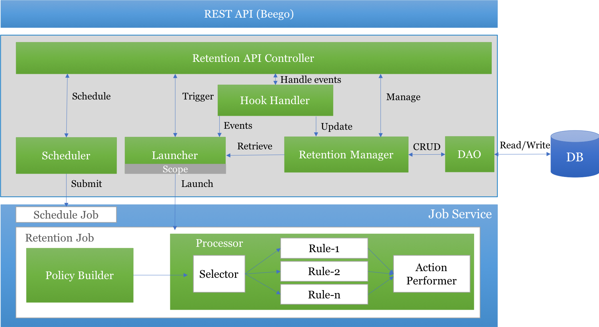
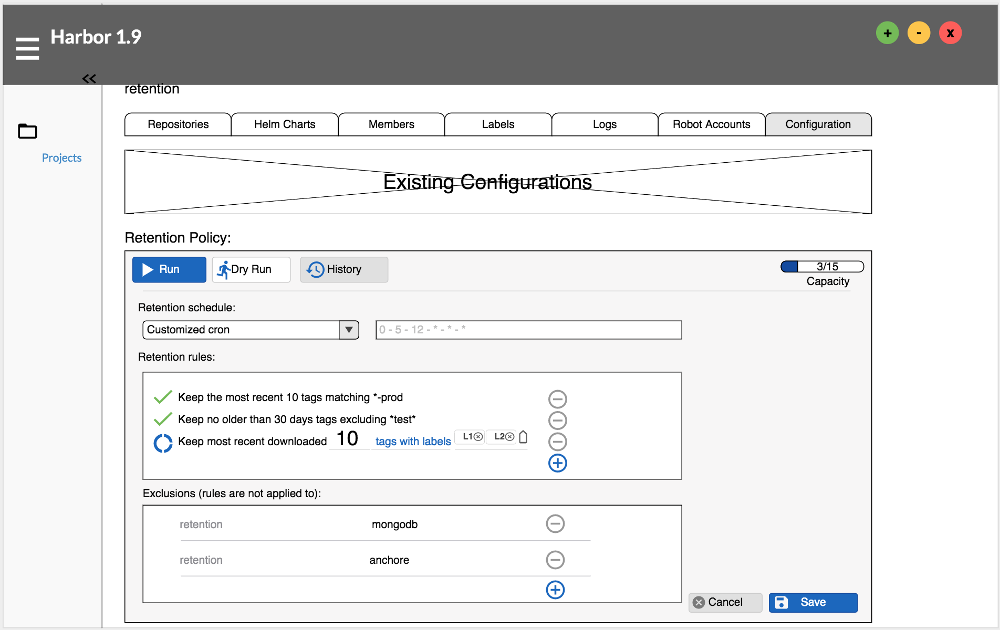
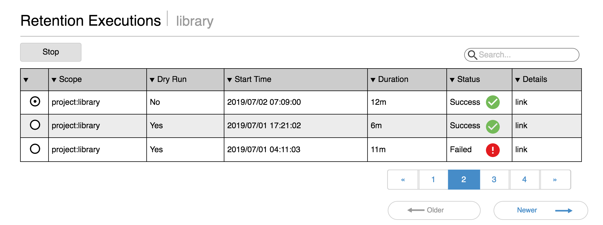
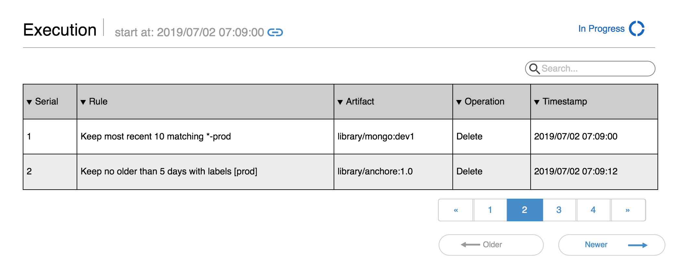

# Proposal: `Tag Retention Patch`

Author: [Steven Zou](https://github.com/steven-zou)

Discussion:

* See epic [#6654][https://github.com/goharbor/harbor/issues/6654]
* More details, check [Tag Retention Project board](https://github.com/goharbor/harbor/projects/5)

## Abstract

This proposal is a patch of the original [proposal](https://github.com/goharbor/community/blob/master/proposals/5882-Tag-Retention-Policies.md) about tag retention policy feature to revise some technical designs which reflect the latest related discussions. To learn more background and the primary idea of tag retention, you can check the above original proposal document.

## Background

See original background [statements](https://github.com/goharbor/community/blob/master/proposals/5882-Tag-Retention-Policies.md#background).

## Proposal

### Overall Design

#### Retention Policy

The request of performing retention will be defined as a retention policy. That means retention will be policy based. A retention policy should include:

* a collection of related retention rules defined in the below section.
  * option of limiting the number of rules in a policy is supported
* a trigger approach declaring how to launch the retention operation process
  * CRON-like schedule
  * Pre-defined `None` represents no schedule enabled
* a scope declaration about the target range to apply the retention operation (each scope only needs attach 1 policy as a default design)
  * system level
  * project level
  * repository level
* an exclusion list including the exceptional repositories which policy will not be applied to

The relationship among rules in one policy will be **OR** way, e.g:

Policy attached to the project _hello-world_ has two rules,

Rule-0 outputs keep `[repo_x/tag1, repo_y/tag2]`
Rule-1 outputs keep `[repo_x/tag3, repo_z/tag5]`

after execution, the tags `[repo_x/tag1, repo_y/tag2, repo_x/tag3, repo_z/tag5]` will be kept, all others will be cleared.

**Notes:** Although _AND_ relationship is not covered in this proposal, the framework proposed here will consider enough flexibilities for the future _AND_ supporting.

#### Retention Rule

A rule is a definition to describe what action will be performed to which resources when what conditions are matched. Here are examples:

Example 1:
> Keep the most recent 10 tags matched *-prod

Example 2:
> Keep the no older than 10 days tags excluding *test*

Example 3:
> Keep the most recent downloaded 20 tags with labels [a,b]

The retention rule can be abstracted to a general format with the following segments:

`RULE=[ACTION][DECORATED CONDITION(PARAMETERS)][SELECTOR]`

In this proposal,

* only `Keep` action is supported to purchase the retention goal with a safe and positive way. All the resources NOT in the `Keep` list will be cleared.
* the following decorated conditions will be prioritized and covered in order:
  * `most recent` which is evaluated based on the _push time_ of the resource
    * parameter required: the number of resources (see above example 1)
  * `no older than` which is evaluated based on the _push time_ of the resource
    * parameter required: the life time with day unit (see above example 2)
  * `most recent downloaded` which is evaluated based on the _pull time_ of the resource
    * parameter required: the number of resources (see above example 3)
  * `all`
    * parameter required: the number of resources
      * parameter can be set to -1 that means no limitation
    * e.g: keep all 10 / keep everything (parameter=-1)
* resource selectors below will also be prioritized and implemented in order:
  * regular expression selector with several pre-defined patterns
    * matching _expression pattern_
    * excluding _expression pattern_
    * in _list_
  * wildcard `**` to match all
  * label selector

For empty policy (no any rules), `Keep everything` will be performed as default design.

The rule will be pre defined as full rule template and initialized as rule instance by letting admins provide the related required parameters when adding to its parent policy.

In summary, the following rule templates will be supported in priority order one by one:

| Rule Template |  Parameter |  Selector |  Priority |
|---------------|------------|-----------|-----------|
|Keep everything|  NO        | **        |  P0       |
|keep most recent X tags | number of tags| All  | P0       |
|Keep no older than X days | life time of tag | All | P0   |
|Keep X tags    | number of tags|  All   |  P1       |
|Keep most recent downloaded X tags | number of tags | All | P1 |

### User Stories

#### Full Management

* As a (system/project) admin, Steven can view and remove the rules of the retention policy attached to the specified project.
* As a (system/project) admin, Steven can add new rule into the policy attached with the specified project by selecting the rule template and providing the required parameter.
* As a (system/project) admin, Steven can select pre-defined schedule (daily, weekly or monthly etc.) or set customized CRON like (* * 24 * * *) schedule to launch the retention process.
* As a (system/project) admin, Steven can luanch a `dry run` process and check the overall summary containing what tags will be cleared if launching this policy.
* As a (system/project) admin, Steven can run the retention policy immediately (manually trigger).
* As a (system/project) admin, Steven can check the retention executing history which includes overall status, related timestamps and what tags are cleared.
* As a (system/project) admin, Steven can disable the retention by setting `None` schedule or clearing the policy.

#### View

* As a developer, Jack can view the rules of the retention policy attached to the specified project.

### Architecture

#### Overall

The following graph shows the overall architecture of tag retention.


* API controller provides unified interface at the top level and serve the request from the upper rest API layer.
* Manager implements the CRUD operations of policy, rule templates and execution history based on the DAOs.
* Scheduler schedules/unschedules a periodic job to generate interval events which launch the retention job.
* The hook handler will listen to the retention job execution status hook events and update the related stats info and history by talking to the manager, or listen to the schedule events and tell the launcher to launch retentions once events coming in.
* Launcher retrieves the raw policy from the manager and gets the repositories based on the scope and exclusion list. Then it launches retention jobs for each of matched repositories.
* A new retention job will be implemented to drive the policy execution.
  * Policy builder builds the policy execution object (a processor) based on the raw policy extract from the job context and gets the artifact candidates for the next step.
  * The processor does the real action of retention
    * Retriever gets the artifact candidates based on the provided repository data
    * Selectors can be applied to narrow down the candidate list before passing to the concreted rules
    * Rules check whether the candidates match the settled conditions or not
    * All the output from rules will send to the performer to do the clear work (all non kept ones will be cleared)

#### Models & Interfaces

##### Model for policy and rule

```go
package retention

// Policy object
type Policy struct {
  // UUID of the policy
  ID string `json:"id"`
  // Capacity for the rule list
  Capacity *Capacity `json:"capacity"`
  // Algorithm applied to the rules
  // "AND", "OR" supported
  // Placeholder for extending
  Algorithm string `json:"algorithm"`
  // Rule collection
  Rules []Rule `json:"rules"`
  // Trigger about how to launch the policy
  Trigger *Trigger `json:"trigger"`
  // Which scope the policy will be applied to
  Scope *Scope `json:"scope"`
  // Exceptional repositories
  Exclusions []*Exclusion `json:"exclusions"`
}

// Capacity declares max number of rules in a policy
type Capacity struct {
  Cap int `json:"cap"`
  Occupied int `json:"occupied"`
}

// Trigger of the policy
type Trigger struct {
  // Const string to declare the trigger type
  // 'Schedule'
  Kind string `json:"kind"`
  // Settings for the specified trigger
  // '[cron]="* 22 11 * * *"' for the 'Schedule'
  Settings map[string]interface{} `json:"settings"`
  // References of the trigger
  // e.g: schedule job ID
  References map[string]interface{} `json:"references"`
}

// Scope definition
type Scope struct {
  // Scope level declaration
  // 'system', 'project' and 'repository'
  Level string `json:"level"`
  // The reference identity for the specified level
  // '' for 'system', project ID for 'project' and repo ID for 'repository'
  Reference string `json:"ref"`
}

// Exclusion
type Exclusion struct {
  // Namespace
  Namespace string `json:"namespace"`
  // Repository name
  Repository string `json:"repo"`
}

// Rule of retention
type Rule struct {
  // UUID of rule
  ID string `json:"id"`
  // Priority of rule when doing calculating
  // Placeholder for extending
  Priority int `json:"priority"`
  // Template ID
  Template string `json:"template"`
  // The parameters of this rule
  Parameters Parameters `json:"params"`
  // Selector attached to the rule
  Selector *Selector `json:"selector"`
}

// Selector to narrow down the list
type Selector struct {
  // Kind of the selector
  // "Reg", "Label"
  Kind string `json:"kind"`
  // Param for the selector
  Value Parameter
}

// Parameters of rule, indexed by the key
type Parameters map[string]Parameter

// Parameter of rule
type Parameter interface{}

func (p Parameter) Int() int { return 0 }
func (p Parameter) String() string { return "" }
func (p Parameter) Strings() []string { return [] }

// Retention execution
type Execution struct {
  ID string `json:"id"`
  PolicyID string `json:"policy_id"`
  StartTime time.Time string `start_time`
  EndTime time.Time string `end_time`
  Status string `json:"status"`
  Scope *Scope `json:"scope"`
}

// Retention history
type History struct {
  ExecutionID string `json:"execution_id"`
  Rule struct {
    ID string `json:"id"`
    DisplayText string `display_text`
  } `json:"rule_id"`
  Artifact string `json:"tag"` // full path: :ns/:repo:tag
  Timestamp time.Time string `timestamp`
  Operation string `json:"operation"`
}
```

**Notes:** Some helper methods of the models may not listed in this proposal.

##### Manager Interface

```go
package retention

// Manager defines operations of managing policy
type Manager interface {
  // Create new policy and return uuid
  CreatePolicy(p *Policy) (string, error)
  // Update the existing policy
  // Full update
  UpdatePolicy(p *Policy) error
  // Delete the specified policy
  // No actual use so far
  DeletePolicy(ID string) error
  // Get the specified policy
  GetPolicy(ID string) (*Policy, error)
  // Create a new retention execution
  CreateExecution(execution *Execution) (string, error)
  // Update the specified execution
  UpdateExecution(execution *Execution) error
  // Get the specified execution
  GetExecution(eid string) (*Execution, error)
  // List execution histories
  ListExecutions(query *q.Query) ([]*Execution, error)
  // Add new history
  AppendHistory(history *History) error
  // List all the histories marked by the specified execution
  ListHistories(executionID string, query *q.Query) ([]*History, error)
}

```

##### Hook Handler Interface

```go
package hook

// Handler handles the hook events
type Handler interface {
  // Handle events
  Handle(stats *job.StatusChange) error
}

```

##### Launcher Interface

```go
package policy

// Launcher provided function to launch the jobs to run retentions
type Launcher interface {
  Launch(policyID string) ([]string, error)
}
```

##### Scheduler Interface

```go
package policy

// Scheduler of launching retention jobs
type Scheduler interface {
  // Schedule the job to periodically run the retentions
  Schedule(policyID string, cron string) (string, error)
  // Unschedule the specified policy
  UnSchedule(policyID string) error
}
```

##### Builder Interface

```go
package policy

// Builder builds the runnable processor from the raw policy
type Builder interface {
  // Builds runnable processor
  Build (rawPolicy string, repository string) (Processor, error)
}
```

##### Processor Interface

```go
package retention

// Artifact represents the processing cloud-native content
type Artifact struct {
  Tag string
  // Type of artifact
  // "image" or "chart"
  Kind string
  PushTime int64
  // more ...
}

// Processor processing the whole policy targeting a repository
type Processor interface {
  // Process the artifact candidates
  Process (artifacts []*Artifacts, rules []Evaluator, performer Performer) error
}

// UnionProcessor will handle the rules with OR pattern in parallel
type UnionProcessor struct {}

// Process implements Processor interface
func (up *UnionProcessor) Process (artifacts []*Artifacts, rules []Evaluator, performer Performer) error {
  return nil
}
```

##### Rule Evaluator Interface

```go
package rule

// Factory is factory method to create new Evaluator
type Factory func (rule *retention.Rule) Evaluator

// Meta is metadata of rule evaluator
type Meta struct {
  // UUID of the rule evaluator
  TemplateID string
  // Text for displaying
  DisplayText string
}

// Registry of evaluators
type Registry map[RuleMeta]RuleFactory

// Evaluator defines method of executing rule
type Evaluator interface{
  // Filter the inputs and return the filtered outputs
  Process (artifacts []*Artifact, selector Selector) ([]*Artifact, error)
}

// MostRecentX implements the most recent X retention rule
type MostRecentX struct {
  X int
}

// Process implements rule Evaluator interface
func (mrx *MostRecentX) Process (artifacts []*Artifact, selector Selector) ([]*Artifact, error) {
  return [], nil
}

// NoOlderThanX implements the no older than X days rule
type NoOlderThanX struct {
  X int //days
}

// Process implements rule Evaluator interface
func (not *NoOlderThanX) Process (artifacts []*Artifact, selector Selector) ([]*Artifact, error) {
  return [], nil
}

```

##### Selector Interface

```go
package rule

// SelectorFactory is factory to create Selector
type SelectorFactory func (selector *retention.Selector) Selector

// SelectorRegistry for registrations of selectors
type SelectorRegistry map[string]Selector

// Selector is used to filter the inputting list
type Selector interface {
  // Select the matched ones
  Select (artifacts []*Artifact) ([]*Artifact, error)
}

// RegExpSelector is for regular expression selector
type RegExpSelector struct {
  // Pre defined pattern declarator
  // "matching", "excluding" and "in"
  decoration string
  // The pattern expression
  pattern string
}

// Select implements Selector interface
func (res *RegExpSelector) Select (artifacts []*Artifact) ([]*Artifact, error) {
  return [], nil
}

// LabelSelector is for label selector
type LabelSelector struct {
  // Pre defined pattern declarator
  // "with" or "without"
  decoration string
  // Label list
  labels []string
}

// Select implements Selector interface
func (ls *LabelSelector) Select (artifacts []*Artifact) ([]*Artifact, error) {
  return [], nil
}
```

##### Performer Interface

```go
package rule

type Performer interface {
  Perform (artifact *Artifact) error
}

// KeepAction handles 'keep' action
type KeepAction struct {}

// Perform 'keep' action
func (ka *KeepAction) Perform (artifact *Artifact) error {
  return nil
}
```

#### API definitions

`GET /api/retentions/:id`

Get the content of the specified retention policy.

* Request body: None
* Response:
  * 200 OK: retention [Policy](#model-for-policy-and-rule)
  * 401 Unauthorized : Common error object
  * 403 Forbidden: Common error object
  * 404 Not found: Common error object
  * 500 Server Internal: Common error object

`POST /api/retentions`

Create a new retention policy with the provided data.

* Request body: retention [Policy](#model-for-policy-and-rule) without ID
* Response:
  * 200 OK: ID of created retention policy
  * 400 Bad request : Common error object
  * 401 Unauthorized : Common error object
  * 403 Forbidden: Common error object
  * 500 Internal Server: Common error object

`PUT /api/retentions/:id`

Update the retention policy like schedule and rule set. For simplification, update adopts full data way.

* Request body: retention [Policy](#model-for-policy-and-rule) with ID
* Response:
  * 200 OK: Updated retention [Policy](#model-for-policy-and-rule)
  * 400 Bad request : Common error object
  * 401 Unauthorized : Common error object
  * 403 Forbidden: Common error object
  * 500 Internal Server: Common error object

`Delete /api/retentions/:id`

Delete the specified retention policy. Just a placeholder, no actual use so far.

`POST /api/retentions/:id/executions`

Run the retention immediately (manually trigger). If `dry_run` is set to be true, no real clear actions will be performed.

* Request body:

```json
  {
    "dry_run" : true
  }
```

* Response:
  * 201 Created: ID of the execution
  * 400 Bad request : Common error object
  * 401 Unauthorized : Common error object
  * 403 Forbidden: Common error object
  * 500 Internal Server: Common error object

`PATCH /api/retentions/:id/executions/:eid`

Terminate the running retention with the provided id. If the specified retention has already been stopped, 200 OK should returned.

* Request body:

```json
{
  "action": "stop"
}
```

* Response:
  * 200 OK: retention [Execution](#model-for-policy-and-rule)
  * 400 Bad request : Common error object
  * 401 Unauthorized : Common error object
  * 403 Forbidden: Common error object
  * 404 Not found: Common error object
  * 500 Internal Server: Common error object

`GET /api/retentions/:id/executions/:eid`

Get the retention execution with the specified ID.

* Request body: None
* Response:
  * 200 OK: retention [Execution](#model-for-policy-and-rule)
  * 401 Unauthorized : Common error object
  * 403 Forbidden: Common error object
  * 404 Not found: Common error object
  * 500 Server Internal: Common error object

`GET /api/retentions/:id/executions`

* Request body: query parameters
* Response:
  * 200 OK: list of retention [Execution](#model-for-policy-and-rule)
  * 401 Unauthorized : Common error object
  * 403 Forbidden: Common error object
  * 404 Not found: Common error object
  * 500 Server Internal: Common error object

`GET /api/retentions/:id/executions/:eid/histories`

Get the detailed history of the specified executions, which included what tags are cleared by what rules.

* Request body: query parameters
* Response:
  * 200 OK: list of retention [History](#model-for-policy-and-rule)
  * 401 Unauthorized : Common error object
  * 403 Forbidden: Common error object
  * 404 Not found: Common error object
  * 500 Server Internal: Common error object

**Notes:** The relationship between scope and policy will depend on the scope relevant API. For example, for `project` scope, the retention policy ID will be kept in the project settings.

### UI Design

Here are several mockups to describe the primary UE scenarios.

The (system/project) admin can configure the retention policy in the configuration tab of the project (create a separate tab in the project view is also ok).


The (system/project) admin can try the dry run of the retention policy and check the progress of the launched execution.


The execution detailed history will be saved for admin to do auditing.


**Notes:** The display text of the rule template needs i18n translation support. The rule (evaluator) implementation providing the default text which can be used as i18n text key to get the right language.

## Non-Goals

[N/A]

## Rationale

[N/A]

## Compatibility

[A discussion of any compatibility issues that need to be considered]

## Implementation

This feature should be delivered into V1.9 (FC: Aug 5th GA: Aug 28th) release as a anchored feature. The work should include the backend service components implementations and the heavy UI work. Base on the release plan of V.9 and the related work of this feature, the plan is defined as following one:

* Before July 2nd: Clarify the use cases (stories) and finalize the technical design details (ready for code). Moreover, do some ground work like interface definitions etc.
  * MM & Alex
  * Nathan
  * Steven Z
* July 2nd - July 30th: Complete the base service components development work and implement the top 3 concrete rules.
  * Steven Z
  * Nathan?
  * Another one?
* July 2nd - July 9th: Confirm the UX design with the designer
  * Louis
  * Steven Z
  * Alex?
* July 9th - July 30th: Implement the UI
  * Shijun Sun (&/ other one?)
* July 30th - August 5th: e2e verifications and p0 bugs fixes
  * All

## Open issues (if applicable)

* Check epic [#6654][https://github.com/goharbor/harbor/issues/6654]
